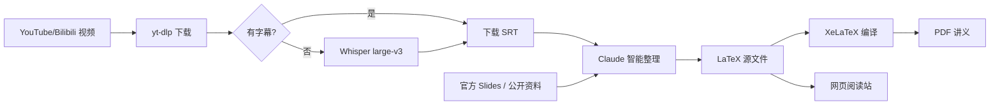

<div align="center">

# 📚 AI Course Notes

**303 份 AI / LLM 中文讲义，支持在线阅读、PDF 下载和 LaTeX 源码查看**

基于公开课视频字幕、课程 slides、访谈、技术文章与公开资料整理，使用 LaTeX 生成 PDF，并自动发布为可搜索的网页阅读站。

[](https://hqhq1025.github.io/ai-course-notes/)
[](.)
[](.)
[](.)

[🌐 在线阅读](https://hqhq1025.github.io/ai-course-notes/) · [📄 浏览目录](#-课程一览) · [🤝 参与贡献](CONTRIBUTING.md)

</div>

---

## ✨ 这是什么

- **在线阅读优先**：网页站点支持目录导航、全文搜索、公式渲染、图片展示，并保留 PDF 备用链接。
- **中文讲义**：英文课程、访谈和文章统一整理为中文，关键技术术语保留英文。
- **覆盖面广**：从 Transformer、LLM pretraining、RLHF，到 Agent、Diffusion、Infra、模型架构和 AI 工程实践。
- **LaTeX 为源文稿**：每份讲义保留 `*-notes.tex` 和 `*-notes.pdf`，网页由 `.tex` 自动转换生成。
- **持续更新**：新课程、演讲、访谈和技术文章会继续补充。

## 🌐 在线阅读

在线站点：**[https://hqhq1025.github.io/ai-course-notes/](https://hqhq1025.github.io/ai-course-notes/)**

站点由 [tools/web/generate_site.py](tools/web/generate_site.py) 从仓库中的 LaTeX 讲义自动生成 MkDocs 项目，并通过 [.github/workflows/pages.yml](.github/workflows/pages.yml) 在 `main` 分支更新后部署到 GitHub Pages。

## 📊 内容规模

| 分类 | 数量 | 说明 |
|------|------|------|
| Stanford 课程 | 142 | CS336、CS224R、CS25、CS153、CS146S、CS224N、CS231N |
| MIT 课程 | 10 | MIT 6.S191 Introduction to Deep Learning |
| KAIST 课程 | 15 | CS492D Diffusion Models and Flow Models |
| Berkeley 课程 | 35 | CS294 LLM Agents / Advanced LLM Agents / Agentic AI |
| B 站系列课程 | 47 | Modern Agent、LLM Architect、Agentic RL |
| 演讲与访谈 | 29 | Lex Fridman、Dwarkesh Patel、青稞、WhynotTV、张小珺等 |
| 技术文章笔记 | 25 | Agent Harness、Claude Code、Codex、Agentic Memory 等 |
| **合计** | **303** | 统计口径：仓库内 `*-notes.tex` 讲义源文件 |

---

## 📋 课程一览

### 🏫 Stanford 课程 (142 份)

| 课程 | 主题 | 讲数 | 讲者 |
|------|------|------|------|
| [**CS336**](cs336/) / [**CS336 2026**](cs336-2026/) | Language Modeling from Scratch | 17 + 10 | Percy Liang, Tatsu Hashimoto |
| [**CS224R**](cs224r/) | Deep Reinforcement Learning | 19 | Chelsea Finn |
| [**CS25**](cs25/) | Transformers United (V1-V5) | 40 | Hinton, Karpathy, Vaswani, Noam Brown... |
| [**CS153**](cs153/) | Infra @ Scale / Frontier Systems | 11 | Anjney Midha + 业界领袖 |
| [**CS146S**](cs146s/) | The Modern Software Developer | 10 | Mihail Eric + 业界嘉宾 |
| [**CS224N**](cs224n/) | NLP with Deep Learning | 17 | Chris Manning |
| [**CS231N**](cs231n/) | Deep Learning for Computer Vision | 18 | — |

### 🏛 MIT 课程 (10 份)

| 课程 | 主题 | 讲数 | 讲者 |
|------|------|------|------|
| [**6.S191**](6s191/) | Introduction to Deep Learning | 10 | Alexander Amini + 业界嘉宾 |

### 🇰🇷 KAIST 课程 (15 份)

| 课程 | 主题 | 讲数 | 讲者 |
|------|------|------|------|
| [**CS492D**](kaist-cs492d/) | Diffusion Models and Flow Models | 15 | Minhyuk Sung |

### 🐻 Berkeley 课程 (35 份)

| 课程 | 主题 | 讲数 | 亮点嘉宾 |
|------|------|------|----------|
| [**CS294 F24**](talks/berkeley-llm-agents/f24/) | LLM Agents | 12 | Denny Zhou, 姚顺雨, Jim Fan, Percy Liang |
| [**CS294 SP25**](talks/berkeley-llm-agents/sp25/) | Advanced LLM Agents | 12 | Jason Weston, AlphaProof, Salakhutdinov |
| [**CS294 F25**](talks/berkeley-llm-agents/f25/) | Agentic AI | 11 | Noam Brown, Oriol Vinyals, James Zou |

### 🇨🇳 B 站系列课程 (47 份)

| 系列 | 主题 | 讲数 | UP 主 |
|------|------|------|------|
| [**Modern Agent**](modern-agent/) | LLM Agent 实战 (ReAct, RAG, Codex) | 17 | 五道口纳什 |
| [**LLM Architect**](llm-architect/) | 模型架构 (MoE, RoPE, VLM, K2.5) | 10 | 五道口纳什 |
| [**Agentic RL**](agentic-rl/) | RL for LLM (PPO→GRPO→DPO, veRL) | 20 | 五道口纳什 |

### 🎤 演讲与访谈 (29 份)

| 来源 / 频道 | 主题 | 数量 | 目录 |
|-------------|------|------|------|
| [**Lex Fridman Podcast**](talks/lex-fridman/) | Dario Amodei、Jensen Huang、State of AI、DeepSeek、中国 AI、OpenClaw | 5 | talks |
| [**AITIME 论道**](talks/aitime/) | 张钹、林俊旸、姚顺雨、杨植麟 | 4 | talks |
| [**青稞社区**](talks/qingke/) | LLM、Agentic、RL、Infra 圆桌 | 4 | talks |
| [**WhynotTV**](interviews/whynot-tv/) | 陈天奇、翁嘉颐、胡渊鸣、杨硕 | 4 | interviews |
| [**张小珺商业访谈录**](interviews/zhang-xiaojun/) | 季逸超、谢赛宁、杨植麟 | 3 | interviews |
| [**Ungrounded 不着边际**](interviews/ungrounded/) | GUI Agent、SGLang | 2 | interviews |
| [**Dwarkesh Patel Podcast**](talks/dwarkesh-patel/) | Ilya Sutskever: From Scaling to Research | 1 | talks |
| [**No Priors Podcast**](talks/no-priors/) | Andrej Karpathy: Code Agents & AutoResearch | 1 | talks |
| [**20VC with Harry Stebbings**](talks/20vc/) | Demis Hassabis: AGI, Scaling Laws & DeepMind | 1 | talks |
| [**Cleo Abram**](talks/cleo-abram/) | Jensen Huang: NVIDIA Vision | 1 | talks |
| [**Greg Isenberg**](talks/greg-isenberg/) | Claude Cowork & Code | 1 | talks |
| [**NVIDIA GTC**](talks/nvidia-gtc/) | 杨植麟 K2.5 | 1 | talks |
| [**阿里云**](talks/alibaba-cloud/) | AGI 圆桌 | 1 | talks |

### 📝 技术文章笔记 (25 篇)

<details>
<summary><b>点击展开文章列表</b></summary>

| 文章 | 来源 |
|------|------|
| **Agent Harness Engineering 专题** | |
| [Harness Engineering](articles/openai-harness-engineering/) | OpenAI |
| [Building Effective Agents](articles/anthropic-building-agents/) | Anthropic |
| [Writing Effective Tools](articles/anthropic-writing-tools/) | Anthropic |
| [Effective Harnesses for Long-Running Agents](articles/anthropic-effective-harnesses/) | Anthropic |
| [Harness Design for Long-Running Apps](articles/anthropic-harness-long-running/) | Anthropic |
| [Improving Deep Agents with Harness Engineering](articles/langchain-improving-deep-agents/) | LangChain |
| [Evaluating Deep Agents](articles/langchain-evaluating-deep-agents/) | LangChain |
| [Agent Needs a Harness, Not a Framework](articles/inngest-agent-harness/) | Inngest |
| [Skill Issue: Harness Engineering](articles/humanlayer-skill-issue/) | HumanLayer |
| [Harness Engineering](articles/fowler-harness-engineering/) | Martin Fowler |
| **其他** | |
| [Anthropic Harness Design](articles/anthropic-harness-design/) | Anthropic Blog |
| [Karpathy: Vibe Coding](articles/dotey-karpathy-translation/) | @kabornethy (宝玉译) |
| [Claude Code Skills 指南](articles/dotey-claude-code-skills-translation/) | @dotey (宝玉译) |
| [Google Agent Skill Patterns](articles/google-agent-skill-patterns/) | Google Blog |
| [OpenAI Codex Best Practices](articles/openai-codex-best-practices/) | OpenAI |
| [OpenAI Codex Datasets](articles/openai-codex-datasets/) | OpenAI |
| [Claude vs Codex](articles/hesamation-claude-vs-codex/) | @hesamation |
| [Claude Architect 模式](articles/hooeem-claude-architect/) | @hooeem |
| [Agentic Memory](articles/ram-agentic-memory/) | @ramfromindia |
| [林俊旸: Agentic Thinking](articles/junyang-lin-agentic-thinking/) | @junyang_lin |
| [10x Skills 指南](articles/minli-10x-skills-translation/) | @MinLiBuilds (实践哥译) |
| [50 Claude Tips](articles/vishwas-50-claude-tips/) | @vishwas_ai |
| [Claude Code Best Practices](articles/panda-claude-code-best-practices/) | @panda_quant |
| [Cowork Starter](articles/corey-cowork-starter/) | @corey_latislaw |
| [Notes from inside China's AI labs](articles/interconnects-china-ai-labs/) | Interconnects AI |

</details>

---

## 🔥 推荐阅读路线

```text
入门 LLM
CS336 → CS224R L09 (RLHF) → CS25 V2 Karpathy (Transformer 入门)

深入 Agent
Berkeley F24 姚顺雨 Agent 概述 → Modern Agent 全系列 → Agentic RL 全系列

模型架构
LLM Architect 全系列 → CS25 V4 Mixtral → CS336 L04 MoE

前沿洞察
Ilya Sutskever → Dario Amodei → Lex Fridman State of AI 2026
```

## 📁 目录结构

```text
ai-course-notes/
├── cs336/                    # Stanford CS336 (17 讲)
├── cs336-2026/               # Stanford CS336 Spring 2026 (10 讲, 进行中)
├── cs153/                    # Stanford CS153 Infra @ Scale (11 讲)
├── cs224n/                   # Stanford CS224N (17 讲)
├── cs231n/                   # Stanford CS231N (18 讲)
├── cs224r/                   # Stanford CS224R (19 讲, 含 slides)
├── cs146s/                   # Stanford CS146S (10 周, 基于 slides)
├── cs25/                     # CS25 Transformers United (40 讲)
├── 6s191/                    # MIT 6.S191 (10 讲)
├── kaist-cs492d/             # KAIST CS492D (15 讲)
├── modern-agent/             # 五道口纳什 Modern Agent (17 讲)
├── llm-architect/            # 五道口纳什 LLM Architect (10 讲)
├── agentic-rl/               # 五道口纳什 Agentic RL + veRL (20 讲)
├── interviews/               # 深度访谈，按频道/来源分组
├── talks/                    # 演讲与公开课，按频道/来源分组
├── articles/                 # 技术文章笔记
├── tools/web/                # 在线阅读站生成器
└── .github/workflows/        # GitHub Pages 自动部署
```

## ⚙️ 生成方式



### 本地预览在线阅读站

```bash
python -m pip install -r requirements-web.txt
python tools/web/generate_site.py --strict --skip-tikz
mkdocs serve -f .web-build/mkdocs.yml
```

完整构建与 GitHub Pages 工作流一致：

```bash
python tools/web/generate_site.py --strict --verbose-warnings --fail-on-tikz-warnings
mkdocs build -f .web-build/mkdocs.yml --strict
```

## 🔗 项目链接

| 项目 | 地址 |
|------|------|
| GitHub 仓库 | [github.com/hqhq1025/ai-course-notes](https://github.com/hqhq1025/ai-course-notes) |
| 在线阅读站 | [hqhq1025.github.io/ai-course-notes](https://hqhq1025.github.io/ai-course-notes/) |
| GitHub Pages 工作流 | [.github/workflows/pages.yml](.github/workflows/pages.yml) |
| 站点生成器 | [tools/web/generate_site.py](tools/web/generate_site.py) |
| 贡献指南 | [CONTRIBUTING.md](CONTRIBUTING.md) |
| 质量标准 | [QUALITY.md](QUALITY.md) |

## 🔗 课程资源链接

| 课程 | 官网 | YouTube | Slides |
|------|------|---------|--------|
| CS336 | [cs336.stanford.edu](https://cs336.stanford.edu/) | [Spring 2025 播放列表](https://www.youtube.com/playlist?list=PLoROMvodv4rOY23Y0BoGoBGgQ1zmU_MT_) | [Spring 2026 GitHub](https://github.com/stanford-cs336/lectures) |
| CS153 | [cs153.stanford.edu](https://cs153.stanford.edu/) | [W25](https://www.youtube.com/playlist?list=PL2aDf5-VARtCwgVceDClce1OcnUk1vIvR) · [S26](https://www.youtube.com/playlist?list=PL2aDf5-VARtBwz1kz5FsuSZXOig2U6aJI) | — |
| CS224R | [cs224r.stanford.edu](https://cs224r.stanford.edu/) | [播放列表](https://www.youtube.com/playlist?list=PLoROMvodv4rPwxE0ONYRa_itZFdaKCylL) | [官网](https://cs224r.stanford.edu/spring_2025/slides/) |
| CS25 | [web.stanford.edu/class/cs25](https://web.stanford.edu/class/cs25/) | [播放列表](https://www.youtube.com/playlist?list=PLoROMvodv4rNiJRchCzutFw5ItR_Z27CM) | — |
| CS146S | [themodernsoftware.dev](https://themodernsoftware.dev) | — | Google Slides |
| CS224N | [官网](https://web.stanford.edu/class/archive/cs/cs224n/cs224n.1246/) | [播放列表](https://www.youtube.com/playlist?list=PLoROMvodv4rNiJRchCzutFw5ItR_Z27CM) | [官网](https://web.stanford.edu/class/archive/cs/cs224n/cs224n.1246/slides/) |
| CS231N | [cs231n.stanford.edu](https://cs231n.stanford.edu/) | [播放列表](https://www.youtube.com/playlist?list=PLoROMvodv4rOABXSygHTsbvUz4G_YQhOb) | [官网](https://cs231n.stanford.edu/slides/2025) |
| KAIST CS492D | [course page](https://mhsung.github.io/kaist-cs492d-fall-2024/) | [播放列表](https://www.youtube.com/playlist?list=PLQ28Nx3M4JrhkqBVIXg-i5_CVVoS1UzAv) | — |
| Berkeley LLM Agents | [rdi.berkeley.edu](https://rdi.berkeley.edu/llm-agents/f24) | [F24](https://www.youtube.com/playlist?list=PLS01nW3RtgopsNLeM936V4TNSsvvVglLc) · [SP25](https://www.youtube.com/playlist?list=PLS01nW3RtgorL3AW8REU9nGkzhvtn6Egn) · [F25](https://www.youtube.com/playlist?list=PLS01nW3RtgoqGkm4UeqNeZLccW-OGc1fJ) | [rdi.berkeley.edu](https://rdi.berkeley.edu/llm-agents/assets/) |

---

## 🤝 贡献

欢迎提 Issue 或 PR：

- 发现讲义内容错误
- 推荐新课程、演讲、访谈或技术文章
- 改进现有讲义质量
- 优化在线阅读站生成效果

更多说明见 [CONTRIBUTING.md](CONTRIBUTING.md) 和 [QUALITY.md](QUALITY.md)。

## 🙏 致谢

讲义生成工具链基于 [wdkns-skills](https://github.com/wdkns/wdkns-skills)（五道口纳什）改进，在此基础上增加了模块化重构、批量处理脚本、文章整理 skill 和在线阅读站生成器等扩展。

## 📜 License

本仓库的讲义、工具和脚本采用 [CC BY-NC-SA 4.0](LICENSE) 许可证。

本项目仅供学习和研究用途。仓库中引用的课程 slides、视频截图等素材的版权归原作者和所属机构所有。如果您是相关内容的版权持有者，认为本项目侵犯了您的权益，请通过 [Issues](../../issues) 联系我们，我们会在确认后第一时间移除相关内容。

<div align="center">

**⭐ 如果觉得有用，请给个 Star！**

</div>
