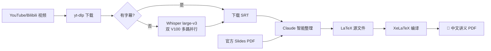

<div align="center">

# 📚 AI Course Notes

**220+ 份 AI / LLM 公开课中文讲义 PDF**

基于视频字幕（Whisper large-v3）、课程 Slides 和公开资料，自动生成的高质量 LaTeX 讲义

[](.)
[](.)
[](.)

</div>

---

## ✨ 亮点

- 🎯 **覆盖广泛**：从 Transformer 原理到 LLM Agent 实战，从强化学习到模型架构设计
- 📖 **中文讲义**：英文课程也全部整理为中文，技术术语保留英文
- 🎨 **排版精美**：LaTeX 专业排版，三种高亮盒子（核心概念/背景知识/常见误解）
- 🤖 **自动化生成**：Whisper 语音转录 + Claude 智能整理 + XeLaTeX 编译
- 🔄 **持续更新**：新课程和演讲持续收录中

---

## 📋 课程一览

### 🏫 Stanford 课程 (121 份)

| 课程 | 主题 | 讲数 | 讲者 |
|------|------|------|------|
| [**CS336**](cs336/) | Language Modeling from Scratch | 17 | Percy Liang, Tatsu Hashimoto |
| [**CS224R**](cs224r/) | Deep Reinforcement Learning | 19 | Chelsea Finn |
| [**CS25**](cs25/) | Transformers United (V1-V5) | 40 | Hinton, Karpathy, Vaswani, Noam Brown... |
| [**CS146S**](cs146s/) | The Modern Software Developer | 10 | Mihail Eric + 业界嘉宾 |
| [**CS224N**](cs224n/) | NLP with Deep Learning | 17 | Chris Manning |
| [**CS231N**](cs231n/) | Deep Learning for Computer Vision | 18 | — |

### 🐻 Berkeley 课程 (35 份)

| 课程 | 主题 | 讲数 | 亮点嘉宾 |
|------|------|------|----------|
| [**CS294 F24**](talks/berkeley-llm-agents/f24/) | LLM Agents | 12 | Denny Zhou, 姚顺雨, Jim Fan, Percy Liang |
| [**CS294 SP25**](talks/berkeley-llm-agents/sp25/) | Advanced LLM Agents | 12 | Jason Weston, AlphaProof, Salakhutdinov |
| [**CS294 F25**](talks/berkeley-llm-agents/f25/) | Agentic AI | 11 | Noam Brown, Oriol Vinyals, James Zou |

### 🇨🇳 B站系列课程 (46 份)

| 系列 | 主题 | 讲数 | UP主 |
|------|------|------|------|
| [**Modern Agent**](modern-agent/) | LLM Agent 实战 (ReAct, RAG, Codex) | 16 | 五道口纳什 |
| [**LLM Architect**](llm-architect/) | 模型架构 (MoE, RoPE, VLM, K2.5) | 10 | 五道口纳什 |
| [**Agentic RL**](agentic-rl/) | RL for LLM (PPO→GRPO→DPO, veRL) | 20 | 五道口纳什 |

### 🎤 演讲与访谈 (27 份)

<details>
<summary><b>点击展开完整列表</b></summary>

| 嘉宾 | 主题 | 来源 |
|------|------|------|
| **Ilya Sutskever** | From Scaling to Research | Dwarkesh Patel |
| **Dario Amodei** | Claude, AGI & Humanity | Lex Fridman |
| **Andrej Karpathy** | Code Agents & AutoResearch | No Priors |
| **Jensen Huang** ×2 | NVIDIA Vision / $4T AI Revolution | Cleo Abram / Lex |
| **杨植麟** ×3 | K2 对话 / Scaling Law / GTC K2.5 | 张小珺 / AITIME / GTC |
| **季逸超** | Manus 最后的访谈 | 张小珺 |
| **谢赛宁** | 7h 马拉松访谈 | AMI |
| **Lex Fridman** ×2 | State of AI 2026 / DeepSeek & China | Lex Fridman |
| **Peter Steinberg** | OpenClaw Agent | Lex Fridman |
| **青稞嘉年华** ×4 | LLM / Agentic / RL / Infra 圆桌 | 青稞社区 |
| **AGI 峰会** ×4 | 张钹 / 林俊旸 / 姚顺雨 / 阿里圆桌 | AITIME / 阿里云 |
| **Greg Isenberg** | Claude Cowork & Code | YouTube |

</details>

---

## 🔥 推荐阅读路线

### 入门 LLM
```
CS336 (从零训LLM) → CS224R L09 (RLHF) → CS25 V2 Karpathy (Transformer入门)
```

### 深入 Agent
```
Berkeley F24 姚顺雨 (Agent概述) → Modern Agent 全系列 → Agentic RL 全系列
```

### 模型架构
```
LLM Architect 全系列 → CS25 V4 Mixtral → CS336 L04 (MoE)
```

### 前沿洞察
```
Ilya (Research时代) → Dario (AGI路线) → Lex (State of AI 2026)
```

---

## 📁 目录结构

```
ai-course-notes/
├── cs336/                    # Stanford CS336 (17讲)
├── cs224n/                   # Stanford CS224N (17讲)
├── cs231n/                   # Stanford CS231N (18讲)
├── cs224r/                   # Stanford CS224R (19讲, 含 slides)
├── cs146s/                   # Stanford CS146S (10周, 基于 slides)
├── cs25/                     # CS25 Transformers United (40讲)
├── modern-agent/             # 五道口纳什 Modern Agent (16讲)
├── llm-architect/            # 五道口纳什 LLM Architect (10讲)
├── agentic-rl/               # 五道口纳什 Agentic RL + veRL (20讲)
├── interviews/               # 深度访谈
├── talks/
│   ├── berkeley-llm-agents/  # Berkeley CS294 (35讲)
│   ├── qingke-*/             # 青稞嘉年华 (4场)
│   ├── ilya-age-of-research/ # Ilya Sutskever
│   ├── dario-amodei-claude/  # Dario Amodei
│   ├── karpathy-code-agents/ # Andrej Karpathy
│   └── ...                   # 更多演讲
└── articles/                 # 技术文章笔记
```

---

## ⚙️ 生成方式



---

## 🔗 课程资源链接

| 课程 | 官网 | YouTube | Slides |
|------|------|---------|--------|
| CS336 | [stanford-cs336.github.io](https://stanford-cs336.github.io/) | [播放列表](https://www.youtube.com/playlist?list=PLoROMvodv4rOY23Y0BoGoBGgQ1zmU_MT_) | [GitHub](https://github.com/stanford-cs336/spring2025-lectures) |
| CS224R | [cs224r.stanford.edu](https://cs224r.stanford.edu/) | [播放列表](https://www.youtube.com/playlist?list=PLoROMvodv4rPwxE0ONYRa_itZFdaKCylL) | [官网](https://cs224r.stanford.edu/spring_2025/slides/) |
| CS25 | [web.stanford.edu/class/cs25](https://web.stanford.edu/class/cs25/) | [播放列表](https://www.youtube.com/playlist?list=PLoROMvodv4rNiJRchCzutFw5ItR_Z27CM) | — |
| CS146S | [themodernsoftware.dev](https://themodernsoftware.dev) | — | Google Slides |
| CS224N | [官网](https://web.stanford.edu/class/archive/cs/cs224n/cs224n.1246/) | [播放列表](https://www.youtube.com/playlist?list=PLoROMvodv4rNiJRchCzutFw5ItR_Z27CM) | [官网](https://web.stanford.edu/class/archive/cs/cs224n/cs224n.1246/slides/) |
| CS231N | [cs231n.stanford.edu](https://cs231n.stanford.edu/) | [播放列表](https://www.youtube.com/playlist?list=PLoROMvodv4rOABXSygHTsbvUz4G_YQhOb) | [官网](https://cs231n.stanford.edu/slides/2025) |
| Berkeley LLM Agents | [rdi.berkeley.edu](https://rdi.berkeley.edu/llm-agents/f24) | [F24](https://www.youtube.com/playlist?list=PLS01nW3RtgopsNLeM936V4TNSsvvVglLc) · [SP25](https://www.youtube.com/playlist?list=PLS01nW3RtgorL3AW8REU9nGkzhvtn6Egn) · [F25](https://www.youtube.com/playlist?list=PLS01nW3RtgoqGkm4UeqNeZLccW-OGc1fJ) | [rdi.berkeley.edu](https://rdi.berkeley.edu/llm-agents/assets/) |

---

## 🤝 贡献

欢迎提 Issue 或 PR：
- 🐛 发现讲义内容错误
- 💡 推荐新课程或演讲
- 📝 改进现有讲义质量

---

## 📜 License

讲义内容基于公开课程资料整理，仅供学习使用。原始课程版权归各学校和讲者所有。

<div align="center">

**⭐ 如果觉得有用，请给个 Star！**

</div>
